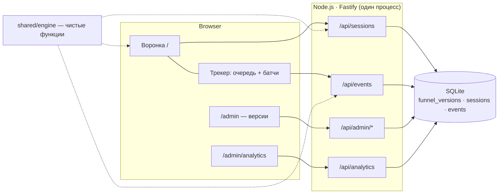

# Funnel Runtime

Мини-платформа для запуска, версионирования и анализа многошаговых веб-воронок:
воронка рендерится из JSON-конфига, версии публикуются и откатываются без деплоя, внутри
версии работает A/B-эксперимент, все действия уходят в собственный endpoint событий,
дашборд считает метрики по уникальным сессиям.

- **Публичный URL:** https://funnel-runtime.onrender.com (воронка) ·
  [/admin](https://funnel-runtime.onrender.com/admin) (версии) ·
  [/admin/analytics](https://funnel-runtime.onrender.com/admin/analytics) (дашборд).
  Free-тариф Render: после простоя первый запрос просыпается до ~50 с.
- **Репозиторий:** https://github.com/coldSeattle/funnel-runtime
- Подробный контракт: [`docs/design.md`](docs/design.md) · план: [`docs/plan.md`](docs/plan.md) ·
  работа с AI-агентами: [`docs/process.md`](docs/process.md) · задание: [`docs/assignment.pdf`](docs/assignment.pdf)

## Как проверить за 5 минут

> Бесплатный инстанс засыпает после ~15 минут простоя: первый запрос будит его до ~50 с, и демо стартует с
> чистой базой (засеянной заново). Проверки лучше делать за один заход.

1. **Воронка.** Откройте https://funnel-runtime.onrender.com/?utm_source=google&utm_campaign=brand_search,
   пройдите пару шагов, нажмите F5 — вы на том же шаге с теми же ответами. Выберите «Hybrid» — появится
   условный шаг про офисные дни, счётчик «Question N of M» пересчитается. Внизу страницы — версия и вариант
   (`v1 · A`). Вариант B: `/?variant=B` (новая сессия с принудительным вариантом).
2. **Версии без деплоя.** `/admin` → на демо v3 уже загружена стартовым сценарием, поэтому просто нажмите
   **Publish** в строке v3. Вкладка, где воронка уже начата, продолжает на v1; новая сессия (приватное окно)
   стартует на v3. **Rollback** возвращает v1, а сессии v3 продолжают на v3. Повторная загрузка
   `configs/funnel-v3.json` вернёт 409 `version_exists` — версии неизменяемы; чтобы увидеть загрузку, поменяйте
   в копии файла `"version"` на 4.
3. **Аналитика.** `/admin/analytics`: фильтры по версии, варианту, кампании, исключение override-сессий;
   сравнение A/B с доверительным интервалом; строка «Consistency» сверяет арифметику дашборда. На свежем
   демо уже есть обе версии: при старте сервер засевает v1 и проигрывает сценарий второй итерации
   (публикация v3, трафик на v3, откат) — см. историю на `/admin`.
4. **Синтетический трафик:** `npm run seed -- --url https://funnel-runtime.onrender.com --sessions 120` —
   печатает ожидаемые числа и сверяет их с приростом на дашборде.
5. **Вторая итерация одной командой:**
   `npm run iteration2 -- --url https://funnel-runtime.onrender.com --traffic 60` — публикует v3, проверяет
   старую сессию, новую ветку и новое событие, делает откат и убеждается, что аналитика не потерялась.

## Локальный запуск

```bash
npm install
npm run dev          # Vite :5173 (проксирует /api) + сервер :3000; пустая БД → публикуется configs/funnel-v1.json
npm test             # Vitest: движок, версии, сессии, A/B, ingest, аналитика, генератор, итерация 2, трекер
npm run typecheck
npm run seed -- --sessions 120 --seed 42                      # синтетический трафик в локальную БД
npm run seed -- --sessions 120 --url http://localhost:3000    # то же самое через HTTP (или на прод)
npm run iteration2 -- --traffic 20                            # приёмка второй итерации (14 проверок) на свежей in-memory БД
npm run build && npm start                                    # прод-сборка, http://localhost:3000
docker build -t funnel-runtime . && docker run -p 3000:3000 -e SEED_ON_BOOT=1 funnel-runtime
```

Переменные окружения: `PORT` (3000), `DATA_DIR` (`./data`, файл `funnel.db`), `SEED_ON_BOOT`
(`1` — при пустой БД прогнать генератор на 120 сессий на v1, затем сценарий второй итерации: публикация v3,
60 сессий на v3, откат на v1), `ADMIN_TOKEN` (если задан, `/api/admin/*` требует
заголовок `x-admin-token`; по умолчанию админка открыта, чтобы проверяющие могли жать Publish и Rollback).

## Архитектура



- **TypeScript везде.** React 19 + Vite (`web/`), Fastify 5 (`server/`), SQLite через better-sqlite3,
  Zod для валидации конфига и запросов, Vitest. Один процесс отдаёт и API, и собранный фронт; один Docker-образ.
  Сторонних сервисов нет: даже шрифты собираются в бандл, а не грузятся с CDN.
- **`shared/engine`** — одни и те же чистые функции на клиенте и сервере: применение варианта
  (`resolveVariant`), условия (`evaluateCondition`: `eq neq in not_in contains gt gte lt lte`, `any`/`all`),
  видимые шаги и переходы, валидация ответа, прогресс, правила результата, whitelist событий.
  Клиент по ним рисует и валидирует, сервер — перепроверяет ответы, считает результат и фильтрует события.
- **Никаких захардкоженных экранов:** шаг рендерится по `step.type` из конфига
  (`info`, `single-select`, `multi-select`, `number`, `result`).

### Жизнь сессии
1. Лендинг → клиент шлёт `POST /api/sessions` со всеми query-параметрами страницы. Сервер берёт
   **активную** версию, назначает вариант (override из `?variant=`, иначе взвешенный random по `weight`),
   сохраняет UTM и пишет `session_started`.
2. Клиент хранит только `sessionId` в `localStorage`. Ответы и текущий шаг живут на сервере
   (`PUT /api/sessions/:id/state`), поэтому Back, refresh и повторное открытие возвращают ровно туда же.
3. `GET /api/sessions/:id` всегда отдаёт конфиг **версии сессии**, даже если активна уже другая, —
   старые сессии спокойно доживают на своей версии.
4. Результат считает сервер по `resultRules` (первое сработавшее правило, иначе `defaultResultId`)
   только по ответам видимых шагов: если пользователь вернулся и сменил `work_mode`, ответ на
   скрытый теперь `office_days` не влияет на вывод.

## Модель данных

| Таблица | Ключ | Что хранит |
|---|---|---|
| `funnels` | `funnel_id` | указатель на активную версию `active_version` |
| `funnel_versions` | `(funnel_id, version)` | конфиг целиком (`config_json`), `created_at`, `published_at`; версии не удаляются |
| `version_history` | `id` | журнал `publish` / `rollback`: `from_version → to_version`, время |
| `sessions` | `id` | закреплённые `version` и `variant`, источник назначения (`server` / `override`), UTM, ответы, текущий шаг, `result_id`, `expires_at` (TTL из конфига, 72 ч) |
| `events` | `event_id` | имя, `client_timestamp`, `server_timestamp`, версия, эксперимент, вариант, шаг, UTM, `properties_json` |

Номер версии берётся из самого конфига (у нас 1 и 3 — «двойки» нет, и это нормально). Поле `status`
в файле игнорируется: статус определяет БД (`active` / `published` / `draft`). Схема только аддитивная
(`CREATE TABLE IF NOT EXISTS`): новое событие в v3 не требует миграции, потому что события хранятся как
`name + properties_json`.

## Event schema

Клиент → `POST /api/events` пачкой (до 500 штук):

```json
{ "events": [ {
  "event_id": "5b0e…",            // UUID, генерирует клиент; ключ идемпотентности
  "session_id": "e3a1…",
  "name": "answer_submitted",
  "client_timestamp": "2026-09-11T12:03:41.120Z",
  "step_id": "work_mode",
  "properties": { "answer_kind": "single" }
} ] }
```

Сервер сам проставляет `server_timestamp`, `funnel_id`, `funnel_version`, `experiment_id`, `variant`,
`utm_source / utm_medium / utm_campaign` **из сессии** — клиенту эти поля не доверяются.

| Событие | Когда | Свойства |
|---|---|---|
| `session_started` | сервер создал сессию | — |
| `step_viewed` | показан видимый шаг (каждый показ) | `step_type`, `visible_step_index`, `visible_step_count` |
| `answer_submitted` | отправлен валидный ответ | `answer_kind` (`single` / `multi` / `number`) |
| `step_completed` | переход вперёд с валидного шага | `next_step_id` |
| `back_clicked` | переход назад | `destination_step_id` |
| `result_viewed` | показан результат | `result_id` |
| `cta_clicked` | клик по основному CTA | `result_id`, `action` |
| `recommendation_expanded` | только v3: раскрыты рекомендации после CTA | `result_id`, `action`, `source` |

Обработка пачки — каждое событие отдельно, ответ всегда 200 со статусом по каждому:

1. форма (Zod; `client_timestamp` — ISO-8601 со смещением или `Z`) → иначе `rejected: invalid_shape`;
2. сессия существует → иначе `rejected: unknown_session`;
3. имя есть в `events.allowed` конфига **версии сессии** → иначе `rejected: unknown_event`;
4. `step_id` — шаг варианта этой сессии → иначе `rejected: unknown_step`;
5. свойства фильтруются по whitelist события (лишнее отбрасывается); значения — только скаляры, `answer_kind` —
   одно из `single | multi | number` → иначе `rejected: invalid_properties`;
6. `INSERT OR IGNORE` по `event_id` → `accepted` или `duplicate`.

Отсюда инварианты задания: повторная отправка того же `event_id` не создаёт дубль; повтор пачки после
таймаута безопасен (придут только `duplicate`); битое событие не ломает пачку. **Сырые ответы в аналитику
не попадают** (`privacy.storeRawAnswers: false`): в событиях только `answer_kind`, а сами ответы лежат в
сессии — они нужны, чтобы восстановить экран и посчитать результат.

Трекер на клиенте: очередь в `localStorage`, отправка пачкой (800 мс или 10 событий), `sendBeacon` при
закрытии вкладки, повтор с backoff 1 → 30 с с теми же `event_id`. Событие удаляется из очереди только
после ответа сервера; неотправленные события прошлой сессии досылаются и после её смены.

## Правила агрегации

Единица счёта — **сессия**. Каждая метрика — число уникальных `session_id`, а не событий.

| Метрика | Определение |
|---|---|
| Начали воронку | сессии с `session_started` |
| Дошли до шага | сессии с хотя бы одним `step_viewed` этого шага (повторные показы и возвраты схлопываются) |
| Прошли шаг | сессии с хотя бы одним `step_completed` этого шага; конверсия шага = прошли / дошли |
| Отвал на шаге | сессии без `result_viewed`, у которых **последний** по времени `step_viewed` — этот шаг |
| Дошли до результата | сессии с `result_viewed` |
| CTR CTA | сессии с `cta_clicked` / сессии с `result_viewed` |
| Основная конверсия | сессии с `cta_clicked` / начавшие |

- Дубли отсекает первичный ключ `event_id`; порядок прихода не важен — считаем множества, а «последний
  просмотр» определяем по `client_timestamp` (`server_timestamp` — tie-break).
- Любая метрика учитывает только начавшие сессии, поэтому арифметика всегда сходится. Дашборд показывает
  проверку: `Σ отвалов + отвалы до первого шага + дошли до результата = начали`.
- Разрезы: вариант A / B, версия, фильтр по `utm_campaign`, тумблер «исключить override-сессии»
  (ручные проверки через `?variant=` не должны портить эксперимент).

## A/B-эксперимент

Вариант назначается на сервере при создании сессии и хранится в ней — после refresh он не меняется.
Для проверки — `?variant=A|B` (такие сессии помечены `assignment_source = override`).
Вариант меняет порядок шагов (`stepSequence`), тексты (`stepOverrides`) и экран результата (`resultOverrides`).

**Гипотеза.** Вариант B снижает трение на входе и делает результат конкретнее: intro обещает время
(«2-minute team check»), первым идёт лёгкий single-select `work_mode` вместо числового `team_size`,
заголовок результата звучит как персональный вывод, CTA — «See the 30-day action list». Ожидаем, что B
доводит до результата и до клика по CTA большую долю начавших.

**Основная метрика:** доля сессий с `cta_clicked` среди начавших воронку — она ловит и эффект входа, и эффект
результата. **Вторичные:** intro → первый вопрос, доля дошедших до результата, CTR среди увидевших результат.
**Guardrail:** среднее число `back_clicked` на сессию — новый порядок вопросов не должен путать.

**Как читать результат.** Сравнение A/B делается внутри одной версии: у v1 и v3 разные эксперименты, поэтому
при «всех версиях» дашборд сравнивает варианты отдельно по каждой версии. Он показывает разницу B − A в
процентных пунктах с 95 % доверительным интервалом и вердикт: «B лучше» / «B хуже» — только если интервал не пересекает ноль; иначе
«значимой разницы нет» или «мало данных». При ~60 сессиях на вариант типичный интервал шире ±10 п.п.,
поэтому решения на таком объёме не принимаются — это видно прямо на экране.

> Данные на демо синтетические: генератор закладывает эффект (у B ниже отвал на intro и выше вероятность
> клика по CTA), но на 120 сессиях он тонет в шуме. Выводов о самой гипотезе из них делать нельзя.

## Генератор трафика

`scripts/generate-traffic.ts` (библиотека — `scripts/traffic/`) проходит воронку через настоящий API тем же
движком, что и клиент, поэтому ветки честные: разные UTM (4 кампании), варианты A и B (плюс ~8 % override),
отвал на разных шагах, возвраты назад, повторные просмотры. Помехи: дубли событий внутри пачки, повторная
отправка целой пачки, перемешанный порядок, битое событие, неизвестное событие; первые сессии
гарантированно покрывают каждый вид помех. В конце генератор сравнивает свои ожидаемые числа с приростом
`/api/analytics` по каждому варианту и печатает `OK` / `MISMATCH` (exit code 1 при расхождении).

## Версии и откат

- `/admin` → загрузить JSON (появится как `draft`) → **Publish**. Без передеплоя.
- **Rollback** отменяет последнюю публикацию: журнал публикаций и откатов работает как стек — повторный откат
  идёт дальше назад, а если откатываться некуда, сервер отвечает 409. Цель отката сервер отдаёт сам
  (`rollbackTarget`), админка показывает её в подтверждении.
- Новые сессии стартуют только на активной версии; старые продолжают на своей — и после публикации, и после отката.
- Аналитика по всем версиям сохраняется: версии и события не удаляются.

## Вторая итерация (v3)

Что изменилось в `configs/funnel-v3.json` и почему код менять не пришлось:

| Изменение v3 | Как система это обрабатывает |
|---|---|
| Новая условная ветка `security_constraints` (если в `priorities` есть `compliance`) | движок поддерживает `contains` и `visibleWhen` с первой итерации |
| У варианта B удалён экран `tool_count` | порядок шагов — это `stepSequence` варианта; прогресс считает только видимые шаги |
| Новое событие `recommendation_expanded` | whitelist событий берётся из конфига версии сессии; схема БД не меняется |
| Новый шаг `meeting_hours` и результаты `regulated_scale`, `meeting_heavy` (оператор `gte`) | правила результата вычисляются по порядку, первое сработавшее |
| Старые активные сессии | закреплены за v1 и продолжают на ней — сервер отдаёт им конфиг их версии |

Проверка — `scripts/iteration2-check.ts` (`npm run iteration2 -- --traffic N`): 14 проверок (без `--traffic`
шаг с синтетическим трафиком пропускается — 13) от «старая сессия стартует на v1»
до «после отката незаконченная сессия v3 продолжает, новые — на v1, аналитика v3 на месте». Проверки опираются
на данные именно этого прогона (прирост счётчиков), а при любом сбое после публикации скрипт сам возвращает v1 —
поэтому его безопасно запускать на проде.

**Прогон на проде: 14 / 14** — полный лог и таблица «требование → проверка» в
[`docs/iteration2-prod-run.md`](docs/iteration2-prod-run.md).

## Таймлайн

Время — UTC+5, 11 сентября 2026. Подробности и решения — в [`docs/process.md`](docs/process.md).

| Время | Итерация 1 |
|---|---|
| до 16:58 | Разбор задания и обоих конфигов, diff v1 → v3, дизайн и план. |
| 17:08 – 17:22 | Контракт (`docs/design.md`), план, общий движок воронки с тестами, схема БД. |
| 17:25 | Параллельно: backend-агент и frontend-агент в отдельных git worktree. |
| 17:38 | Первый деплой на Render (каркас) — проверка пайплайна. |
| 18:13 – 18:31 | Бэкенд и фронтенд готовы; ревью бэкенда в три линзы, исправления. |
| 18:33 | Интеграция, живой прогон на прод-сборке: API и полный проход воронки со сверкой событий в БД. |
| 18:42 | Генератор трафика и полировка бэкенда влиты; 189 тестов. |
| 18:50 | **Первая рабочая версия на проде**, тег [`iteration-1`](https://github.com/coldSeattle/funnel-runtime/releases/tag/iteration-1). |

| Время | Итерация 2 |
|---|---|
| с 17:22 | Движок с первой итерации понимает всё, что нужно v3: `contains`, `gte`, `visibleWhen`, whitelist событий из конфига версии — поэтому v3 не потребовала изменений кода или схемы. |
| 18:48 – 19:14 | Скрипт приёмки второй итерации (`npm run iteration2`), ревью в три линзы, исправление. |
| 19:15 – 19:43 | Доводка: проверки на данных именно этого прогона, автоматический откат при сбое, демо-сценарий v3 при старте сервера. |
| 19:45 | Деплой `8f29e10` на Render; при старте демо проиграло сценарий: `publish 1 → 3 → rollback → 1`. |
| 19:46 – 19:47 | **Вторая итерация на проде: 14 / 14** — v3 опубликована, проверена и откачена; тег [`iteration-2`](https://github.com/coldSeattle/funnel-runtime/releases/tag/iteration-2). Лог — [`docs/iteration2-prod-run.md`](docs/iteration2-prod-run.md). |
| 19:48 – 20:40 | Финальное ревью всего репозитория (14 агентов) и фронтенда в роли проверяющего; одна волна исправлений: откат как стек отмен, строже проверка конфигов и событий, сравнение A/B внутри версии. |

## Соответствие заданию

| Требование | Где реализовано | Как проверить |
|---|---|---|
| Воронка из JSON с backend, без захардкоженных экранов | `GET /api/sessions/:id` отдаёт конфиг; `web/funnel` рендерит по `step.type` | Воронка на проде |
| single / multi / number / info / результат + CTA | `web/funnel/steps/*`, `shared/engine/validate.ts` | Пройти воронку |
| Условные переходы, ≥ 6 экранов, ветвление | `visibleWhen` + `shared/engine/visibility.ts`; v1 — 9 шагов, ветка `office_days` | «Hybrid» → появляется шаг |
| Прогресс только по доступным шагам | `shared/engine/progress.ts` | после «Hybrid» общее число вопросов растёт на один, после «Remote» — нет |
| Back, refresh, повторное открытие без потери состояния | состояние сессии на сервере + `sessionId` в `localStorage` | F5 посреди воронки |
| Публикация без передеплоя, активная версия, откат | `/admin`, `server/services/versions.ts` | Upload v3 → Publish → Rollback |
| Версия закреплена за сессией; старые — на старой, новые — на активной | `sessions.version`; конфиг по версии сессии | Две вкладки после Publish |
| A/B на backend, стабильно, override | `server/services/sessions.ts`; `?variant=` | F5 не меняет вариант; `?variant=B` |
| Вариант меняет тексты, порядок, результат | `resolveVariant` (deep merge overrides) | `?variant=A` vs `?variant=B` |
| События с версией и вариантом | сервер проставляет из сессии | `/admin/analytics` → By variant / By version |
| Свой endpoint, 7 событий, поля, UTM | `POST /api/events`, `server/services/ingest.ts` | `tests/server/ingest.test.ts` |
| Идемпотентность, пачки, повтор, битое событие | PK `event_id`, пособытийная обработка | повторная пачка → `duplicate` |
| Сырые ответы не в аналитике | whitelist свойств: только `answer_kind` | `tests/server/ingest.test.ts` |
| SQLite | `server/db.ts` | — |
| Дашборд по уникальным сессиям, все метрики и разрезы | `server/services/aggregate.ts`, `web/admin/AnalyticsPage.tsx` | `/admin/analytics` |
| Повторы, возвраты, дубли, порядок событий | множества + «последний просмотр» по `client_timestamp` | `tests/analytics/aggregate.test.ts` |
| Генератор ≥ 100 сессий со всеми видами помех | `npm run seed` | печатает ожидаемое vs фактическое |
| TS fullstack, React, Node, один репозиторий, публичный URL, без сторонних сервисов | — | — |
| Автотесты: закрепление версии, A/B, дедуп, publish/rollback, метрики | `tests/**` | `npm test` |
| Вторая итерация: ветка, экран удалён для B, новое событие, откат без миграций | см. раздел «Вторая итерация» | `npm run iteration2` |

## Тесты

| Файл | Проверяет |
|---|---|
| `tests/engine/*` | условия, варианты, видимость и игнор ответов скрытых шагов, валидация, прогресс, правила результата, whitelist событий, схема конфига |
| `tests/server/versions.test.ts` | загрузка, публикация, откат, журнал, 400 на невалидный конфиг, 409 на дубликат |
| `tests/server/sessions.test.ts` | закрепление версии за сессией (и после отката), TTL, валидация ответов, скрытие шага вариантом |
| `tests/server/ab.test.ts` | стабильность варианта, override, распределение ≈ 50/50, версия и вариант в событиях |
| `tests/server/ingest.test.ts` | дедупликация, повтор пачки, битое событие в пачке, whitelist имён и свойств по версии, строгие timestamp |
| `tests/analytics/*`, `tests/server/analytics-route.test.ts` | расчёт метрик на сценарии с дублями, возвратами и перемешанным порядком; фильтры; пустая БД |
| `tests/server/generator.test.ts` | генератор трафика: ожидаемые числа совпадают с дашбордом, все виды помех, v3 |
| `tests/server/iteration2.test.ts` | сценарий второй итерации целиком |
| `tests/web/*` | трекер (батчинг, backoff, повтор с теми же `event_id`, досылка очереди прошлой сессии), история шагов для системной «назад», статистика A/B (Уилсон, Ньюкомб) и группировка по версиям, состояние дашборда |

## Работа с AI-агентами

Задача решалась связкой агентов Claude Code под управлением оркестратора: общий фундамент (контракт,
движок, схема) — последовательно, дальше backend, frontend и генератор — параллельно в отдельных git
worktree; каждый блок проходил ревью в несколько «линз» с перепроверкой находок агентами-скептиками и
раундом исправлений; интеграция — только после зелёных тестов и живого прогона. Как задача дробилась, что
находили ревью и какие решения принимались — в [`docs/process.md`](docs/process.md).

## Ограничения и допущения

- Порядок событий внутри сессии — по часам клиента (`client_timestamp`); для дашборда этого достаточно.
- Одна воронка: схема БД допускает несколько `funnel_id`, интерфейс — нет.
- Условия `visibleWhen` могут ссылаться только на предыдущие шаги последовательности.
- Админка открыта, если не задан `ADMIN_TOKEN` (осознанно — для проверки). Загружаемый конфиг проходит строгую
  проверку (Zod + инварианты каждого варианта после применения overrides), а любой рестарт возвращает демо в
  исходное состояние. В реальном продукте — `ADMIN_TOKEN` или SSO и аудит публикаций.
- События истёкшей сессии принимаются: очередь трекера может досылать их позже TTL.
- Вариант назначается случайно на сервере, поэтому итоги генератора между прогонами немного различаются;
  сверка при этом точная. Проверка генератора предполагает, что параллельно нет чужого трафика.
- Хостинг — Render free: диск не постоянный, а инстанс засыпает после ~15 минут простоя. При каждом старте
  БД пересоздаётся и заново засевается (`SEED_ON_BOOT=1`: v1 + 120 сессий, затем сценарий второй итерации),
  так что демо всегда живое и показывает обе версии. Всё, что сделано вручную — опубликованные версии,
  незаконченные сессии, события, — после сна или рестарта сбрасывается, поэтому «повторное открытие» стоит
  проверять в пределах одного захода. Для продакшена — persistent disk или внешний том; код менять не нужно
  (`DATA_DIR`).
- Холодный старт free-инстанса — до ~50 с.
